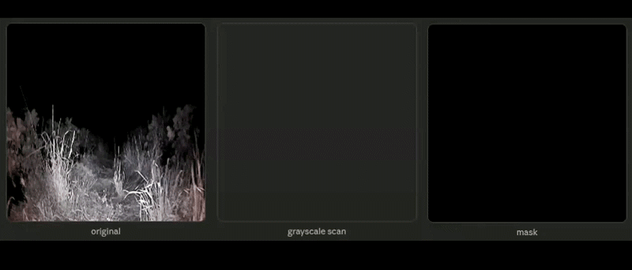

# Enabling 24-hour Agricultural Robotics: Unsupervised Day-to-Night Cross-Modal Image Translation for Nighttime Visual Navigation

| Cycle | Clip |
|:-----:|:----:|
|  |  |

# AgriNight Dataset

| Farm | Daytime | Nighttime |
|:----:|:-------:|:---------:|
| Strawberry Farm 1 |  |  |
| Strawberry Farm 2 |  |  |
| Carrot Field |  |  |

|            | # Day | # Night | # Rows |
|------------|------:|--------:|-------:|
| **Total**        | 428 | 549 | 20 |
| **Strawberry A** | 181 | 185 | 5 |
| **Strawberry B** | 150 | 185 | 9 |
| **Carrot**       | 97  | 179 | 6 |

**Summary of collected daytime and nighttime images and the number of crop rows covered in each farm.**

|       | Traversable | Non-Traversable |     Other |
|-------|------------:|----------------:|----------:|
| **Day**   |   **15.5%** |       **37.8%** |     46.7% |
| **Night** |       12.2% |           33.9% | **53.9%** |

**Class-wise pixel distribution for daytime and nighttime images in the AgriNight dataset.**

| Farm | Daytime | Converted Nighttime |              Segmentation               |
|:----:|:-------:|:-------------------:|:---------------------------------------:|
| Farm 1 |  |  |  |
| Farm 2 |  |  |  |

# Unsupervised Day2Night Cross Modal Translation

|              Farm A               |              Farm B               |
|:---------------------------------:|:---------------------------------:|
|  |  |

**Sample videos of segmentation on converted nighttime images from strawberry farms A & B.**

## Masking Method

## Getting Started

### Environmental Setup

[[Placeholder]]

### Training

* Translation Model

`` command placeholder ``

* Segmentation Model

`` command placeholder ``

### Inference

* Translation Model

`` command placeholder ``

* Segmentation Model

`` command placeholder ``

