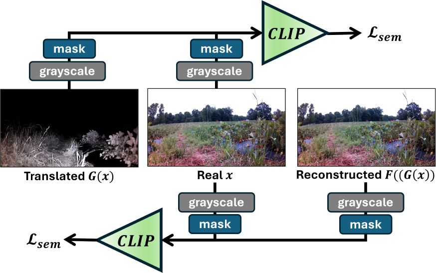
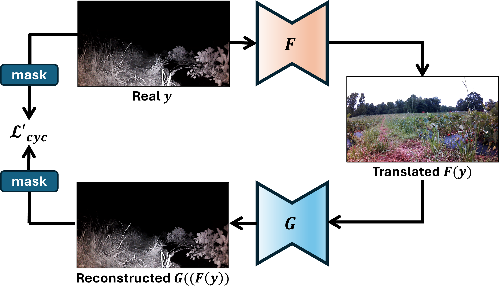
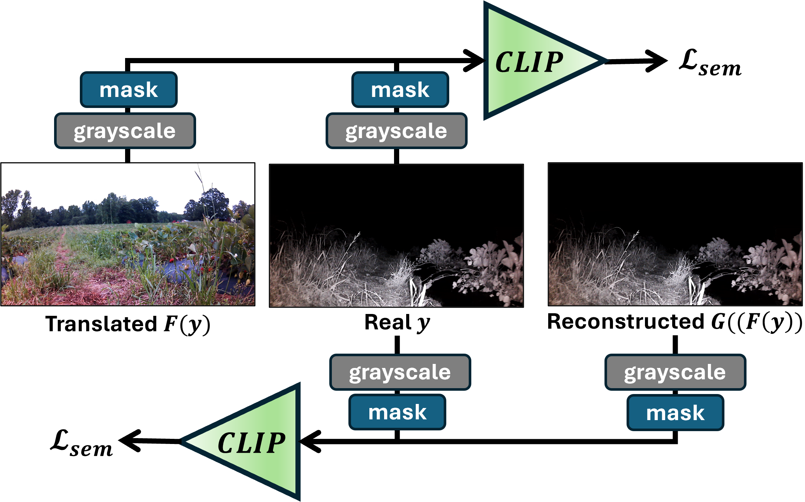

# Enabling 24-hour Agricultural Robotics: Unsupervised Day-to-Night Cross-Modal Image Translation for Nighttime Visual Navigation


**We propose an unsupervised day-to-night cross-modal image translation framework for nighttime visual navigation. By incorporating a pre-trained Contrastive Language–Image Pretraining (CLIP) model, the proposed framework is designed to preserve semantic consistency during day-to-night translation. Furthermore, a visibility mask is introduced to account for the limited effective sensing range of NIR nighttime cameras. We also introduce AgriNight—a novel dataset comprising 428 daytime and 549 nighttime images.**

# Architecture

<!-- Cycle consistency loss is calculated between $x\in X$, where $X$ is the set of all real daytime images, $y\in Y$, where $Y$ is the set of all real nighttime images, and their reconstructed day- and night-time counterparts. -->
### Masked Cycle Consistency Loss

To account for the limited effective sensing range of NIR night-vision sensors, we apply binary visibility masks ($m$ and $m'$) to the cycle consistency loss. This ensures the optimization ignores pixels outside the sensor's reliable range. We enforce:

$$\forall x \in p_X, \quad m \odot F(G(x)) \approx m \odot x$$
$$\forall y \in p_Y, \quad m' \odot G(F(y)) \approx y$$

Where:
* $m$ is a mask generated from the translated nighttime image $G(x)$
* $m'$ is generated from the real nighttime image $y$. The resulting masked cycle consistency loss is defined as:

$$\mathcal{L}'_{cyc} = \mathbb{E}_{x \sim p_X} [\|m \odot F(G(x)) - m \odot x\|_1] + \mathbb{E}_{y \sim p_Y} [\|m' \odot G(F(y)) - y\|_1]$$

### Semantic Consistency Loss (CLIP)

To preserve semantic structure across domains, we utilize a pre-trained CLIP image encoder $E$. The semantic consistency loss $\mathcal{L}_{sem}$ is calculated using the cosine similarity between the embeddings of the masked original and translated images. 

To minimize the influence of domain-specific color information, all images are converted to grayscale before encoding. Given the cosine similarity function $\cos_E(a, b)$, the loss is defined as:

$$
\begin{aligned}
\mathcal{L}_{sem} = \mathbb{E}_{x \sim p_X} & \left[ 1 - \cos_E(m \odot G(x), m \odot x) + 1 - \cos_E(m \odot F(G(x)), m \odot x) \right] \\
+ \mathbb{E}_{y \sim p_Y} & \left[ 1 - \cos_E(m' \odot F(y), y) + 1 - \cos_E(m' \odot G(F(y)), y) \right]
\end{aligned}
$$

$$
\begin{array}{rl}
\mathcal{L}_{sem} = \mathbb{E}_{x \sim p_X} & \left[ 1 - \cos_E(m \odot G(x), m \odot x) + 1 - \cos_E(m \odot F(G(x)), m \odot x) \right] \\
+ \mathbb{E}_{y \sim p_Y} & \left[ 1 - \cos_E(m' \odot F(y), y) + 1 - \cos_E(m' \odot G(F(y)), y) \right]
\end{array}
$$

Where:
* $m, m'$ are the binary **visibility masks** simulating the effective sensing range of NIR sensors.
* $G(x)$ and $F(y)$ are the translated images.
* $F(G(x))$ and $G(F(y))$ are the reconstructed counterparts.


| Cycle |                CLIP                 |
|:-----:|:-----------------------------------:|
|  |  |
|  | |

# AgriNight Dataset

We collected the AgriNight dataset using a mobile robot platform equipped with a night-vision camera in agricultural fields and manually annotated with pixel-wise semantic segmentation labels. The mobile robot platform was manually controlled using a playstation controller across 2 strawberry farms and 1 indoor carrot field. For the strawberry farms, the camera was mounted approximately 33 cm from the ground and without any external infra-red led lights. For the indoor carrot field we set the camera lower approximately 22cm above ground and an external infra-red led light for better visibility. The daytime images were collected under clear weather condidtions and the nighttime images were collected after sunset between 9PM and midnight.

| Farm | Daytime | Nighttime |
|:----:|:-------:|:---------:|
| Strawberry Farm 1 |  |  |
| Strawberry Farm 2 |  |  |
| Carrot Field |  |  |

<center>

|            | # Day | # Night | # Rows |
|------------|------:|--------:|-------:|
| **Total**        | 428 | 549 | 20 |
| **Strawberry A** | 181 | 185 | 5 |
| **Strawberry B** | 150 | 185 | 9 |
| **Carrot**       | 97  | 179 | 6 |

**Summary of collected daytime and nighttime images and the number of crop rows covered in each farm.**

|       | Traversable | Non-Traversable |     Other |
|-------|------------:|----------------:|----------:|
| **Day**   |   **15.5%** |       **37.8%** |     46.7% |
| **Night** |       12.2% |           33.9% | **53.9%** |

**Class-wise pixel distribution for daytime and nighttime images in the AgriNight dataset.**

</center>

| Farm | Daytime | Converted Nighttime |              Segmentation               |
|:----:|:-------:|:-------------------:|:---------------------------------------:|
| Farm 1 |  |  |  |
| Farm 2 |  |  |  |

# Translation Examples


|              Farm A               |              Farm B               |
|:---------------------------------:|:---------------------------------:|
|  |  |

**Sample videos of segmentation on converted nighttime images from strawberry farms A & B.**

## Masking Method


**Demo of masking method being performed for each column of a grayscaled nighttime image.**

* The original input image is initially converted to grayscale with intensity ranging between [0, 255].
* For each column in the grayscale image we look for the first pixel from the top of the image with intensity value greater than a threshold.
* The selected pixel and every other pixel in the column down to the bottom of the image is selected and set to 1 in the binary mask.

## Getting Started

### Project Structure

```
Unsupervised-Day-to-Night-Cross-Modal-Image-Translation-for-Nighttime-Visual-Navigation
|──assets
|──configs
|   |──config.yml
|──datasets
|   |──carrotfield_ds
|   |   |──carrot_day_train
|   |   |──carrot_day_val
|   |   |──carrot_night_train
|   |   |──carrot_night_val
|   |──full_night_3fold
|   |   |──set_1
|   |   |   |──train
|   |   |   |──val
|   |   |──<set_2, set_3>
|   |──strawberryfield_ds
|   |   |──day_train_set
|   |   |──day_val_set
|   |   |──night_train_set
|   |   |──night_val_set
|──predictions
|──segmentation_checkpoints
|   |──day_segmodel.pth
|──src
|   |──src_utils
|   |   |──combine.py
|   |   |──create_pred_sets.py
|   |   |──get_acc.py
|   |   |──relabel.py
|   |──style_inference.py
|   |──train_cyclegan.py
|   |──train_segment.py
|──README.md
```

We included a daytime segmentation checkpoint model for users who want to test our code with the feature preservation loss proposed by one of the benchmark model comparisons used in our paper. Furthermore, we also provide the 3-fold set, `full_night_3fold`, that we created for the users to easily replicate the tables we constructed in our paper. Both the checkpoints and data splits can be defined from the config file.

### Environmental Setup

**Our models were trained and tested on a 24 GB NVIDIA RTX A5000 GPU. We have provided all the necessary library and driver installation in the requirments.txt file.**

**Use the requirements.txt file to create your python virtual environment**

* `` python -m venv <venv_name> ``
* `` source <venv_name>/bin/activate ``
* `` pip install -r requirements.txt ``

### Training Translation Model

**while in src folder:**

* `` python train_cyclegan.py --config ../configs/config.yaml ``

### Creating Converted Nighttime Set

* `` python style_inference.py ``

### Organizing Converted Nighttime Set For Segmentation

* `` python src/create_pred_sets.py ``
* `` python src/relabel.py ``

### Training and Evaluating Segmentation

* `` python train_segment.py ``
* `` python src/get_acc.py ``
