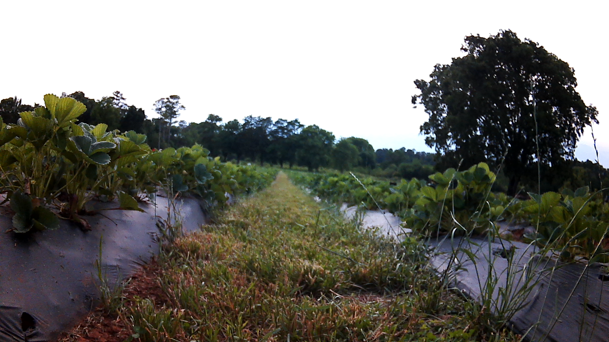
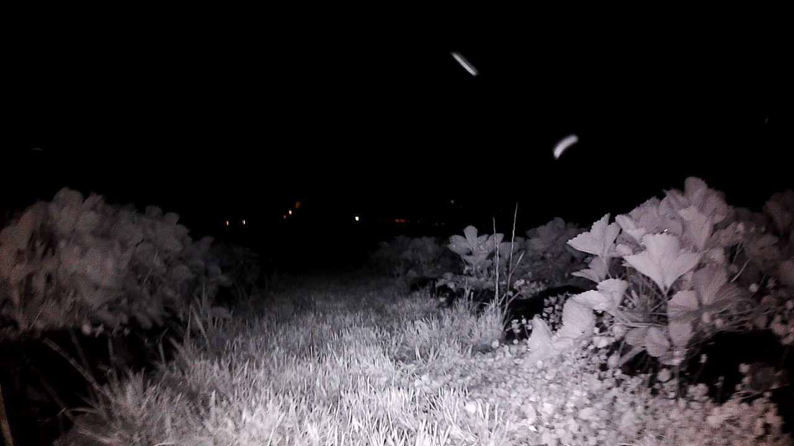
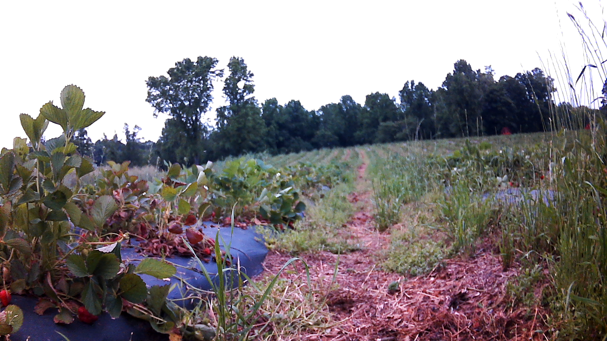
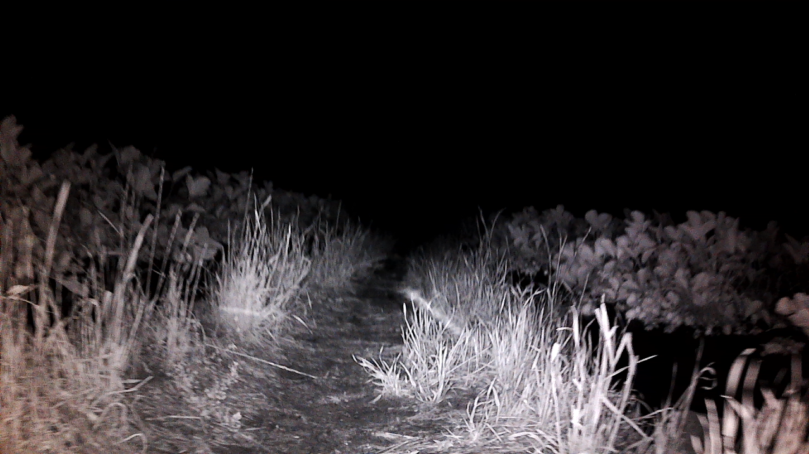
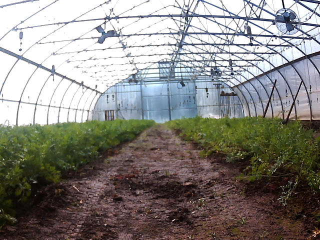
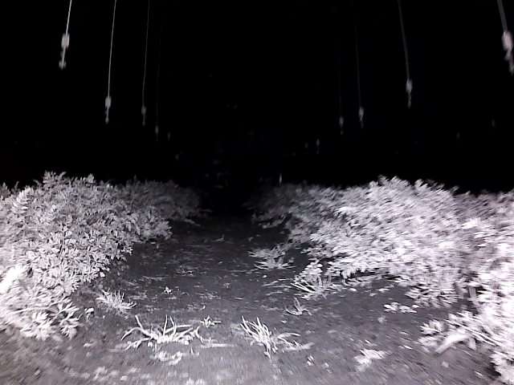
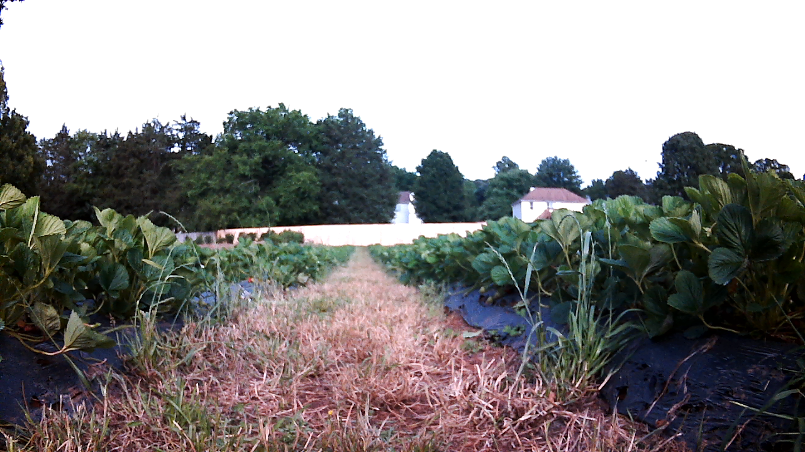
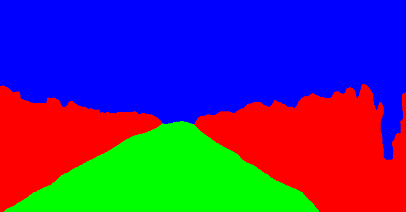
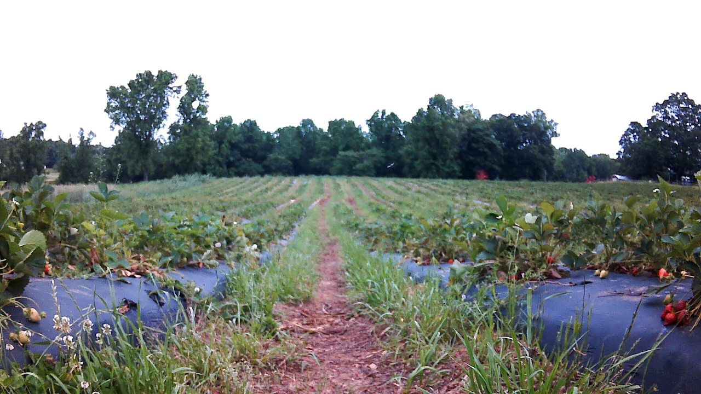
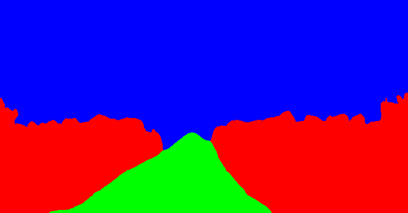

# Enabling 24-hour Agricultural Robotics: Unsupervised Day-to-Night Cross-Modal Image Translation for Nighttime Visual Navigation

|                                                             Cycle                                                             |                                                             Clip                                                              |
|:-----------------------------------------------------------------------------------------------------------------------------:|:-----------------------------------------------------------------------------------------------------------------------------:|
| 

 | 

 |

# AgriNight Dataset

|       Farm        |                            Daytime                             |                           Nighttime                           |
|:-----------------:|:--------------------------------------------------------------:|:-------------------------------------------------------------:|
| Strawberry Farm 1 | 

 | 

  |
| Strawberry Farm 2 | 

 | 

  |
|   Carrot Field    |  

   | 

 |

|            | # Day | # Night | # Rows |
|------------|------:|--------:|-------:|
| **Total**        | 428 | 549 | 20 |
| **Strawberry A** | 181 | 185 | 5 |
| **Strawberry B** | 150 | 185 | 9 |
| **Carrot**       | 97  | 179 | 6 |

**TABLE I**: Summary of collected daytime and nighttime images and the number of crop rows covered in each farm.

|       | Traversable | Non-Traversable |     Other |
|-------|------------:|----------------:|----------:|
| **Day**   |   **15.5%** |       **37.8%** |     46.7% |
| **Night** |       12.2% |           33.9% | **53.9%** |

**TABLE II**: Class-wise pixel distribution for daytime and nighttime images in the AgriNight dataset.

| Farm |                                                       Daytime                                                        | Converted Nighttime | Segmentation |
|:----:|:--------------------------------------------------------------------------------------------------------------------:|:-------------------:|:------------:|
| Farm 1 |                                

                                | 

 | 

 |
| Farm 2 | 

 | 

 | 

 |

# Unsupervised Day2Night Cross Modal Translation

[[Vid Placeholder]]

## Masking Method

[[Examples placeholder]]

## Getting Started

### Environmental Setup

[[Placeholder]]

### Training

* Translation Model

`` command placeholder ``

* Segmentation Model

`` command placeholder ``

### Inference

* Translation Model

`` command placeholder ``

* Segmentation Model

`` command placeholder ``

